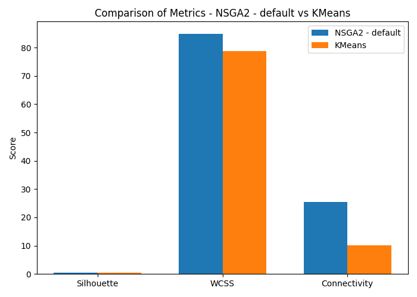
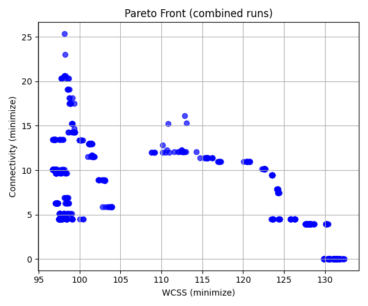
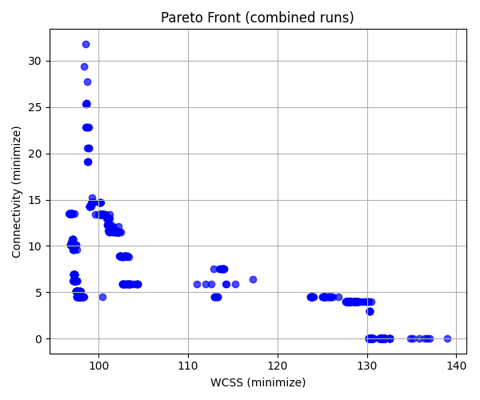

# Clustering Multi-Objectif

## Algorithmes Évolutionnaires pour la Segmentation Avancée de Données

Harrar Mhamed - Rachid Chabane

- **Domaine :** Clustering Multi-Objectif
- **Jeu de données :** Iris (150 échantillons, 4 variables, 3 classes)

---

## Objectifs de Recherche

### Défis du Clustering

- Minimiser la Somme des Carrés Intra-Cluster (WCSS)
- Maximiser la Connectivité de Voisinage
- Équilibrer des Objectifs Concurrents

### Algorithmes Comparés

- NSGA-II (Algorithme de Tri Non-Dominé)
- SPEA2 (Algorithme Évolutionnaire de Pareto)
- Référence : K-means

---

## Configurations Expérimentales

### Configurations de NSGA-II

1. **Configuration par Défaut**

   - Population : 80 individus
   - Descendants : 40 par génération
   - Probabilité de croisement : 0,9

2. **Configuration Explorative**

   - Population : 100 individus
   - Descendants : 80 par génération
   - Taux de mutation : Doublé

3. **Configuration Exploitative**
   - Descendants : Réduits à 20
   - Probabilité de mutation : Divisée par 2
   - Probabilité de croisement : 0,95

---

## Configurations Expérimentales (SPEA2)

### Configurations de SPEA2

1. **Configuration par Défaut**

   - Similaire aux paramètres par défaut de NSGA-II
   - Population : 80 individus
   - Descendants : 40 par génération

2. **Configuration Explorative**

   - Population : 100 individus
   - Descendants : 80 par génération
   - Taux de mutation : Doublé

3. **Configuration Exploitative**
   - Population : 80 individus
   - Descendants : 80 par génération
   - Probabilité de mutation : Réduite
   - Probabilité de croisement : 0,95

---

## Métriques de Performance

### Indicateurs Principaux

- WCSS (Somme des Carrés Intra-Cluster)
- Connectivité de Voisinage
- Coefficient de Silhouette
- Hypervolume

### Statistiques Comparatives (Moyenne ± Écart-type)

| Algorithme     | WCSS          | Connectivité | Silhouette   | Hypervolume |
| -------------- | ------------- | ------------ | ------------ | ----------- |
| K-means        | 78,94 ± 0,001 | 12,59 ± 1,98 | 0,55 ± 0,002 | N/A         |
| NSGA-II Défaut | 98,68 ± 8,86  | 13,94 ± 2,93 | 0,53 ± 0,01  | 3,57 ± 0,94 |
| SPEA2 Défaut   | 103,44 ± 8,98 | 16,05 ± 4,23 | 0,51 ± 0,02  | 4,12 ± 1,05 |

---

## Métriques de Performance (Suite)

| Algorithme          | WCSS          | Connectivité | Silhouette  | Hypervolume |
| ------------------- | ------------- | ------------ | ----------- | ----------- |
| NSGA-II Exploitatif | 97,35 ± 0,58  | 16,07 ± 5,37 | 0,54 ± 0,01 | 3,92 ± 1,33 |
| SPEA2 Exploitatif   | 101,72 ± 7,41 | 15,15 ± 2,95 | 0,52 ± 0,01 | 3,82 ± 0,74 |
| NSGA-II Exploratif  | 98,62 ± 1,35  | 17,87 ± 6,17 | 0,49 ± 0,03 | 4,43 ± 1,62 |
| SPEA2 Exploratif    | 99,40 ± 1,26  | 22,13 ± 7,33 | 0,47 ± 0,03 | 5,51 ± 1,89 |

---

## Analyse du Front de Pareto : NSGA-II

### Observations Principales

- Trois régions distinctes dans le front de Pareto

1. Faible WCSS (96-98), Connectivité Modérée (10-25)
2. WCSS Intermédiaire (100-115), Faible Connectivité (5-15)
3. WCSS Élevé (125-130), Très Faible Connectivité (0-4)

---

## Analyse du Front de Pareto : SPEA2

### Caractéristiques Distinctives

- Solutions plus dispersées aux extrémités
- Connectivité allant jusqu'à 30
- Densité réduite dans la région médiane du front
- Proportion plus élevée de solutions dominées

---

## Meilleure Solution Individuelle

### Configuration Explorative de SPEA2

- Hypervolume : 8,17 (Performance exceptionnelle)
- WCSS : Proche du minimum (97,64)
- Connectivité : Excellente préservation (jusqu'à 32,54)

---

## Implications Pratiques

### Recommandations de Clustering

| Besoin                        | Algorithme Recommandé |
| ----------------------------- | --------------------- |
| Clusters Compacts             | K-means               |
| Équilibre Compacité/Voisinage | NSGA-II Exploitatif   |
| Préservation du Voisinage     | SPEA2 Exploratif      |

### Avantages Clés de l'Approche Multi-Objectif

- Compromis multiples de solutions
- Solutions de clustering flexibles
- Meilleure exploration des compromis

---

## Conclusions

### Résultats Principaux

1. Supériorité de NSGA-II en qualité et stabilité des solutions
2. Approches multi-objectifs explorent les compromis WCSS-Connectivité
3. Algorithmes évolutionnaires offrent un spectre de solutions diversifiées
4. Configurations exploratoires fournissent le meilleur hypervolume

### Approche Recommandée

- Utiliser NSGA-II avec configuration par défaut
- Réaliser plusieurs exécutions indépendantes
- Sélectionner les solutions selon les priorités spécifiques de l'application

---

## Perspectives de Recherche Future

### Directions Potentielles

- Tester sur des jeux de données plus complexes
- Explorer de nouvelles métriques d'évaluation
- Développer des variantes d'algorithmes avancées
- Investiguer :
  - Algorithme MOEA/D
  - Variations NSGA-III
  - Clustering de données de grande dimension

---

## Des Questions ?

### Merci pour votre attention

Harrar Mhamed | Rachid Chabane
