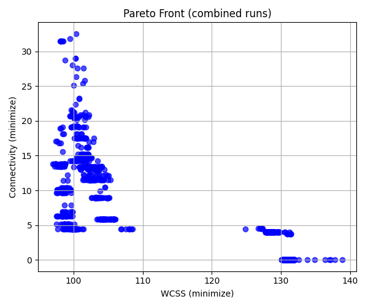

# Résolution du Problème de Clustering Multi-Objectif avec JMetalPy

### M2 MIAGE 
#### Harrar Mhamed - Rachid Chabane

---

## 1. Contexte et Objectifs

### Problématique Principale

- Clustering multi-objectif avec deux critères conflictuels :
- WCSS (Compacité intra-cluster)
- Connectivité (Préservation des relations de voisinage)

### Algorithmes Étudiés

- NSGA-II (Non-dominated Sorting Genetic Algorithm II)
- SPEA2 (Strength Pareto Evolutionary Algorithm 2)
- Comparaison avec K-means classique

---

## 2. Méthodologie Expérimentale

### Configurations des Algorithmes

#### NSGA-II

- Configuration par défaut
- Configuration explorative
- Configuration exploitative
- Configuration à mutation élevée

#### SPEA2

- Configuration par défaut
- Configuration explorative
- Configuration exploitative

---

## 3. Métriques d'Évaluation

### Indicateurs Principaux

- WCSS (Within-Cluster Sum of Squares)
- Connectivité
- Coefficient de Silhouette
- Hypervolume

### Comparaison avec K-means

| Algorithme | WCSS Moyen | Connectivité | Silhouette |
| ---------- | ---------- | ------------ | ---------- |
| K-means    | 78.94      | 12.59        | 0.55       |
| NSGA-II    | 98.68      | 13.94        | 0.53       |
| SPEA2      | 103.44     | 16.05        | 0.51       |

---

## 4. Résultats Principaux : Front de Pareto - NSGA-II

### Analyse du Front de Pareto NSGA-II

---

## 4. Résultats Principaux : Front de Pareto - SPEA2

### Analyse du Front de Pareto SPEA2

---

## 5. Configurations Algorithmiques : NSGA-II

### Approches Exploratoires NSGA-II

---

## 5. Configurations Algorithmiques : SPEA2

### Approches Exploratoires SPEA2

---

## 6. Implications Pratiques

### Recommandations de Clustering

| Besoin                        | Algorithme Recommandé |
| ----------------------------- | --------------------- |
| Clusters compacts             | K-means               |
| Compromis compacité/voisinage | NSGA-II Exploitative  |
| Préservation du voisinage     | SPEA2 Explorative     |

### Meilleure Solution Clustering

---

## 7. Conclusion et Perspectives

### Perspectives de Recherche

- Tester sur des jeux de données plus complexes
- Explorer de nouvelles métriques d'évaluation
- Développer des variantes d'algorithmes avancées

---

## Questions ?

### Merci pour votre attention

Contactez-nous pour plus de détails sur cette recherche.
