# Rapport TP5 : Résolution du Problème de Clustering Multi-Objectif avec JMetalPy

## 1. Contexte et objectifs

Ce travail porte sur l'application des algorithmes évolutionnaires multi-objectifs au problème de clustering, en utilisant deux critères conflictuels pour mesurer la qualité des partitions :

- Le WCSS (Within-Cluster Sum of Squares), qui mesure la compacité intra-cluster
- La connectivité, qui évalue la préservation des relations de voisinage

L'objectif principal est de comparer différentes approches évolutionnaires multi-objectifs (NSGA-II et SPEA2) avec l'algorithme K-means classique, puis d'identifier les configurations algorithmiques les plus performantes.

### 1.1 Présentation des algorithmes

**NSGA-II** (Non-dominated Sorting Genetic Algorithm II) est un algorithme évolutionnaire multi-objectif de référence qui :

- Classe les solutions selon leur rang de non-dominance
- Utilise une mesure de crowding pour maintenir la diversité
- Applique une sélection élitiste qui préserve les meilleures solutions

**SPEA2** (Strength Pareto Evolutionary Algorithm 2) est une alternative qui :

- Maintient une archive externe des solutions non-dominées
- Assigne une fitness basée sur le nombre de solutions dominées et la densité
- Utilise une technique d'élimination préservant la diversité

## 2. Méthodologie et configurations expérimentales

Pour évaluer les performances des algorithmes évolutionnaires multi-objectifs, nous avons testé différentes configurations qui explorent divers compromis entre l'exploration et l'exploitation de l'espace de recherche. Chaque algorithme a été exécuté 10 fois par configuration pour obtenir des résultats statistiquement significatifs.

### 2.1 Configurations de NSGA-II

- **Configuration par défaut**: Population de 80 individus, 40 enfants par génération, probabilité de mutation standard et probabilité de croisement de 0.9.
- **Explorative**: Configuration orientée vers l'exploration de l'espace de recherche avec une population plus grande (100 individus), plus d'enfants (80) et une probabilité de mutation doublée.
- **Exploitative**: Configuration favorisant l'exploitation des meilleures solutions avec moins d'enfants (20), une probabilité de mutation réduite de moitié et une probabilité de croisement élevée (0.95).
- **Mutation élevée (high_mut)**: Configuration standard mais avec un taux de mutation très élevé (multiplicateur de 3.0) pour faciliter l'échappement aux optima locaux.

### 2.2 Configurations de SPEA2

- **Configuration par défaut**: Similaire à NSGA-II avec 80 individus, 40 enfants, probabilités standard.
- **Grande population (large_pop)**: Population de 120 individus pour une meilleure couverture de l'espace de recherche.
- **Explorative**: Configuration similaire à celle de NSGA-II, orientée exploration.
- **Exploitative**: Configuration favorisant l'exploitation, avec les mêmes paramètres que pour NSGA-II.

### 2.3 Méthodologie expérimentale

Notre approche expérimentale s'articule autour des éléments suivants:

- Chaque configuration a été exécutée 10 fois pour assurer la significativité statistique
- Pour chaque exécution, nous avons conservé le front Pareto complet et la meilleure solution selon l'hypervolume
- Les résultats sont visualisés sous forme de fronts Pareto, distributions d'hypervolume, et comparaisons directes avec K-means
- Toutes les expériences ont été réalisées sur le jeu de données Iris standard (150 observations, 4 variables, 3 classes)

Pour évaluer quantitativement la qualité des fronts Pareto obtenus, nous utilisons l'indicateur d'hypervolume, qui mesure le volume de l'espace objectif dominé par l'ensemble des solutions non-dominées, par rapport à un point de référence. Ce point de référence est défini comme [WCSS_max * 1.05, Connectivité_max * 1.05], où WCSS_max et Connectivité_max sont les pires valeurs observées pour chaque objectif parmi toutes les solutions du front. Plus l'hypervolume est élevé, plus le front Pareto couvre efficacement l'espace des objectifs. Cet indicateur permet de comparer objectivement les performances globales des différentes configurations algorithmiques.

## 3. Référence K-means

Afin d'établir une base de comparaison, nous avons exécuté l'algorithme K-means classique sur le jeu de données Iris, avec 3 clusters. Voici les résultats obtenus en moyenne sur 20 exécutions avec différentes initialisations :

- WCSS moyen : 78.94 ± 0.001
- Connectivité moyenne : 12.59 ± 1.98
- Silhouette moyenne : 0.55 ± 0.002

Ces valeurs serviront de référence pour évaluer les performances des approches multi-objectifs.

## 4. Analyses comparatives des configurations

### 4.1 Analyse des résultats NSGA-II (configuration par défaut)

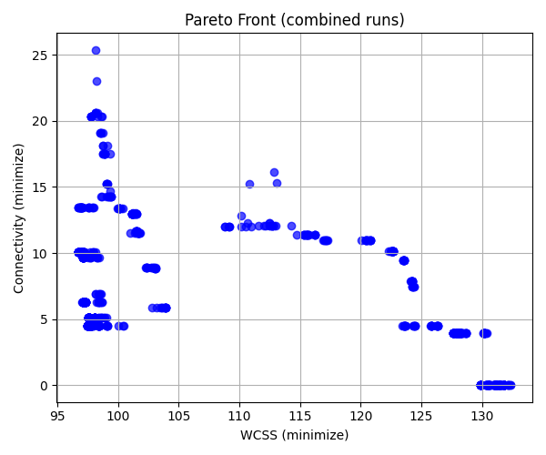

L'analyse des exécutions NSGA-II avec configuration par défaut révèle:

| Statistique | WCSS   | Connectivité | Hypervolume |
| ----------- | ------ | ------------ | ----------- |
| Moyenne     | 98.68  | 13.94        | 3.57        |
| Écart-type  | 8.86   | 2.93         | 0.94        |
| Minimum     | 96.75  | 10.09        | 2.44        |
| Maximum     | 125.56 | 18.78        | 4.99        |

Le front de Pareto présente une structure discontinue avec trois régions distinctes:

1. WCSS[96-98], connectivité[10-25]: compromis optimal entre compacité et préservation de voisinage
2. WCSS[100-115], connectivité[5-15]: région intermédiaire modérément peuplée
3. WCSS[125-130], connectivité[0-4]: solutions extrêmes privilégiant la préservation de voisinage

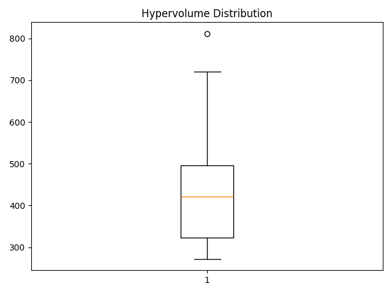

Les runs 9 et 10 produisent des solutions sous-optimales (WCSS>110), indiquant une convergence vers des optima locaux. Les valeurs minimales obtenues (WCSS=96.75, connectivité=10.09) démontrent une amélioration significative de la connectivité par rapport à K-means (connectivité=12.59), au prix d'une légère dégradation du WCSS (K-means: 78.94).

### 4.2 Analyse des résultats SPEA2 (configuration par défaut)

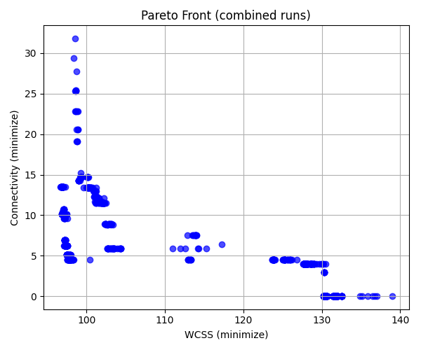

Les résultats de SPEA2 montrent:

| Statistique | WCSS   | Connectivité | Hypervolume |
| ----------- | ------ | ------------ | ----------- |
| Moyenne     | 103.44 | 16.05        | 4.12        |
| Écart-type  | 8.98   | 4.23         | 1.05        |
| Minimum     | 96.91  | 11.99        | 3.26        |
| Maximum     | 120.76 | 25.75        | 6.38        |

SPEA2 présente une variabilité plus prononcée que NSGA-II, particulièrement pour la connectivité (écart-type: 4.23 vs 2.93). Le front de Pareto se caractérise par:

1. Une distribution plus dispersée des solutions aux extrémités (connectivité jusqu'à >30)
2. Une densité réduite dans la région médiane du front
3. Une proportion plus élevée de solutions dominées

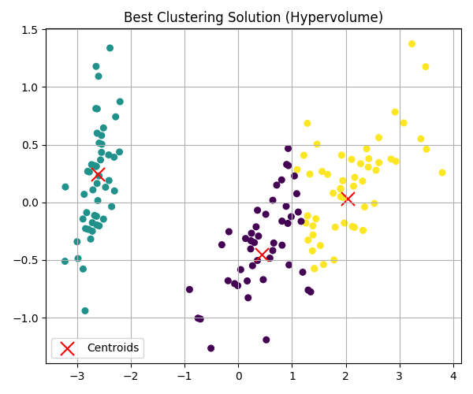
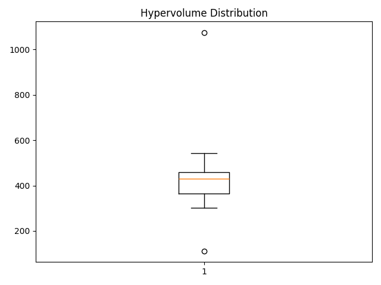

L'hypervolume moyen supérieur (4.12 vs 3.57) s'explique par l'étendue plus large du front plutôt que par la qualité des solutions. Les meilleures valeurs obtenues (WCSS=96.91, connectivité=11.99) sont légèrement inférieures à celles de NSGA-II. La présence de valeurs extrêmes (run 1: connectivité=31.82, run 4: connectivité=7.58) indique une instabilité dans l'algorithme.

L'analyse comparative révèle que SPEA2 tend à explorer davantage les régions extrêmes du front au détriment de la convergence vers des solutions de compromis optimal.

### 4.3 Analyse des résultats NSGA-II (configuration exploitative)

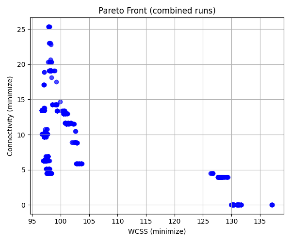

La configuration exploitative de NSGA-II privilégie l'exploitation des meilleures solutions avec une population d'enfants réduite (20 au lieu de 40), un taux de mutation plus faible (0.5×) et une probabilité de croisement plus élevée (0.95).

| Statistique | WCSS  | Connectivité | Hypervolume |
| ----------- | ----- | ------------ | ----------- |
| Moyenne     | 97.35 | 16.07        | 3.92        |
| Écart-type  | 0.58  | 5.37         | 1.33        |
| Minimum     | 96.72 | 10.09        | 2.45        |
| Maximum     | 98.30 | 25.37        | 6.22        |

L'analyse du front de Pareto révèle une structure similaire à la configuration par défaut, mais avec des caractéristiques distinctes:

1. Une distribution plus dense de solutions dans la région à faible WCSS (96-98)
2. Une exploration moins poussée des régions à WCSS élevé/connectivité très faible
3. Une absence quasi-totale de solutions intermédiaires (WCSS entre 105-125)

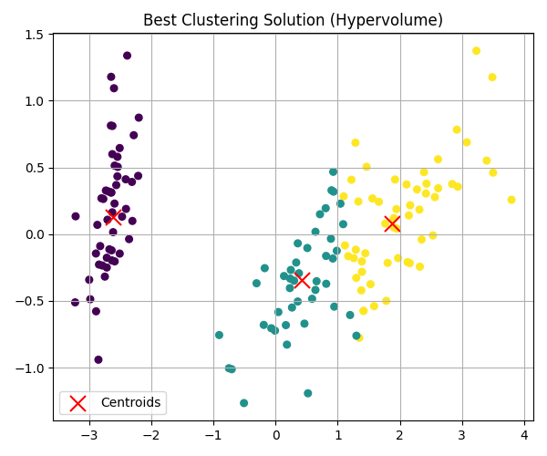
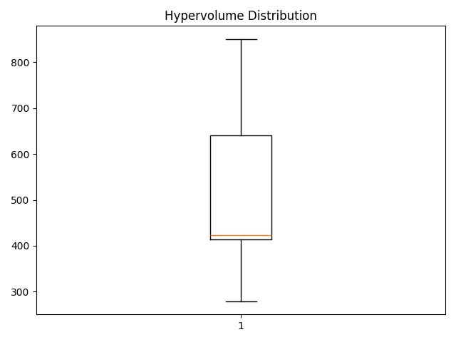

Ces observations sont cohérentes avec la nature exploitative de cette configuration. La variance réduite du WCSS (écart-type de 0.58 contre 8.86 pour la configuration par défaut) confirme la convergence plus uniforme des exécutions. La valeur minimale de WCSS obtenue (96.72) est légèrement meilleure que celle de la configuration par défaut (96.75), montrant que l'intensification peut produire des solutions ponctuellement supérieures.

L'hypervolume moyen est supérieur (3.92 vs 3.57), suggérant que les fronts Pareto, bien que moins étendus, offrent un meilleur compromis dans les régions explorées. Cette configuration semble particulièrement efficace pour identifier des clusters de bonne qualité quand l'objectif principal est de minimiser le WCSS tout en maintenant une connectivité raisonnable.

### 4.4 Analyse des résultats SPEA2 (configuration exploitative)

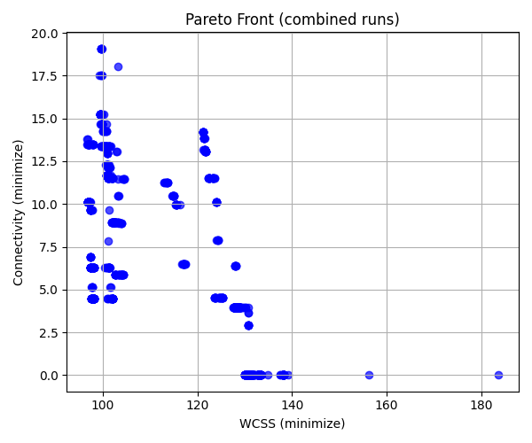

La configuration exploitative de SPEA2 utilise une taille de population d'enfants égale à la population principale (80), un taux de mutation réduit (0.5×) et une probabilité de croisement élevée (0.95) pour favoriser l'exploitation.

| Statistique | WCSS   | Connectivité | Hypervolume |
| ----------- | ------ | ------------ | ----------- |
| Moyenne     | 101.72 | 15.15        | 3.82        |
| Écart-type  | 7.41   | 2.95         | 0.74        |
| Minimum     | 96.77  | 9.65         | 2.45        |
| Maximum     | 121.29 | 19.09        | 4.76        |

L'analyse du front de Pareto révèle:

1. Une distribution plus homogène des solutions, particulièrement dans la région WCSS[96-110]/connectivité[5-15]
2. Une exploration plus limitée des solutions à très faible connectivité
3. Une absence relative de solutions dans les zones intermédiaires (WCSS[110-125])
4. Une présence accrue de solutions dans la région de faible WCSS (meilleure que la configuration par défaut)

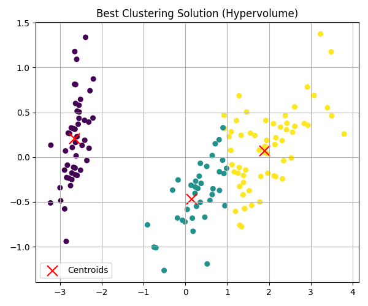
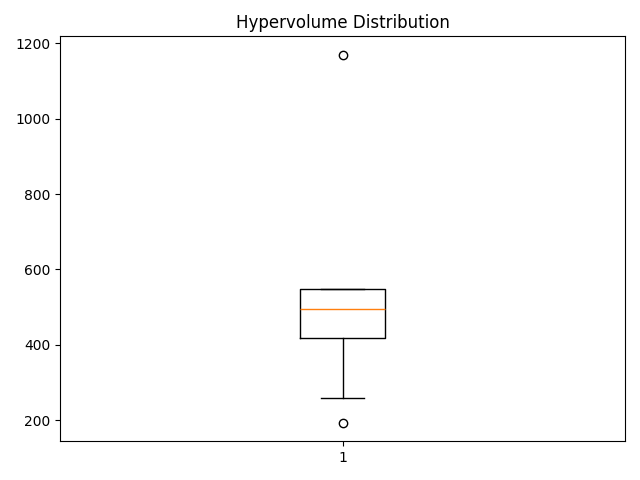

Le front Pareto exploitatif de SPEA2 montre une convergence plus nette vers les régions de compromis optimal par rapport à sa configuration par défaut. La valeur minimale de WCSS obtenue (96.77) est légèrement supérieure à celle de la configuration exploitative de NSGA-II (96.72), mais présente une connectivité moins favorable (9.65 contre 10.09).

La variabilité réduite du WCSS (écart-type de 7.41 contre 8.98 pour la configuration par défaut) démontre un comportement plus consistant, bien qu'une valeur aberrante (run 9 avec WCSS=121.29) indique une sensibilité persistante aux conditions initiales. L'hypervolume moyen (3.82) est légèrement inférieur à celui de NSGA-II exploitatif (3.92).

### 4.5 Analyse des résultats NSGA-II (configuration explorative)

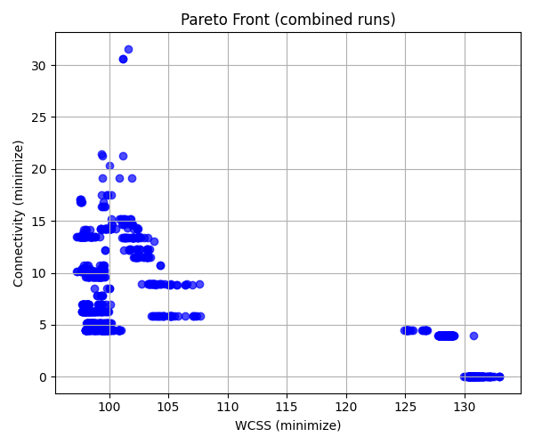

La configuration explorative de NSGA-II favorise l'exploration de l'espace de recherche avec une population plus grande (100 individus), plus d'enfants (80) et un taux de mutation doublé (2.0×).

| Statistique | WCSS   | Connectivité | Hypervolume |
| ----------- | ------ | ------------ | ----------- |
| Moyenne     | 98.62  | 17.87        | 4.43        |
| Écart-type  | 1.35   | 6.17         | 1.62        |
| Minimum     | 97.52  | 10.09        | 2.47        |
| Maximum     | 101.61 | 31.57        | 8.02        |

L'analyse du front de Pareto révèle:

1. Une extension significative du front dans la région de haute connectivité (>20)
2. Une concentration moindre de solutions dans la région à faible WCSS/faible connectivité
3. Une densité accrue dans la zone WCSS[97-100]/connectivité[15-20]
4. Une diversité globale plus élevée des solutions non-dominées

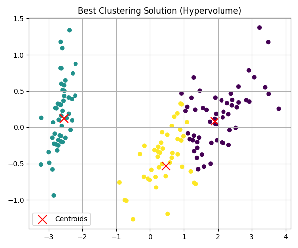
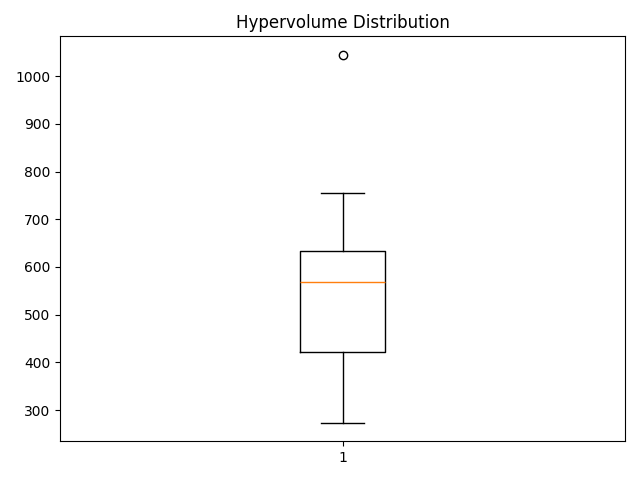

La configuration explorative montre un hypervolume moyen supérieur (4.43) par rapport aux configurations par défaut (3.57) et exploitative (3.92). Cette amélioration s'explique par l'exploration plus complète du front Pareto, notamment dans les régions de connectivité élevée, malgré une légère dégradation de la qualité des meilleures solutions en termes de WCSS.

L'écart-type important de la connectivité (6.17) indique une variabilité accrue dans cette dimension, tandis que la stabilité relative du WCSS (écart-type de 1.35) montre que l'exploration privilégie la diversification le long de l'axe de connectivité. Le front Pareto présente une structure plus continue que dans les autres configurations.

### 4.6 Analyse des résultats SPEA2 (configuration explorative)

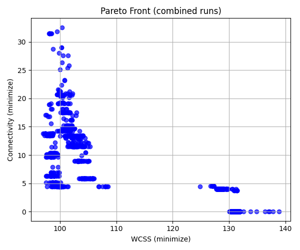

La configuration explorative de SPEA2 utilise une population plus large (100), plus d'enfants (80) et un taux de mutation doublé (2.0×) pour favoriser l'exploration de l'espace de recherche.

| Statistique | WCSS   | Connectivité | Hypervolume |
| ----------- | ------ | ------------ | ----------- |
| Moyenne     | 99.40  | 22.13        | 5.51        |
| Écart-type  | 1.26   | 7.33         | 1.89        |
| Minimum     | 97.64  | 13.77        | 3.38        |
| Maximum     | 101.60 | 32.54        | 8.17        |

L'analyse du front de Pareto révèle:

1. Une expansion significative vers des régions de haute connectivité (>30), surpassant toutes les autres configurations
2. Une densité accrue de solutions dans la zone WCSS[97-100]/connectivité[15-25]
3. Une distribution plus éparse des solutions dans la zone de connectivité intermédiaire
4. L'absence quasi-totale de solutions dans la zone de très faible connectivité (<5)

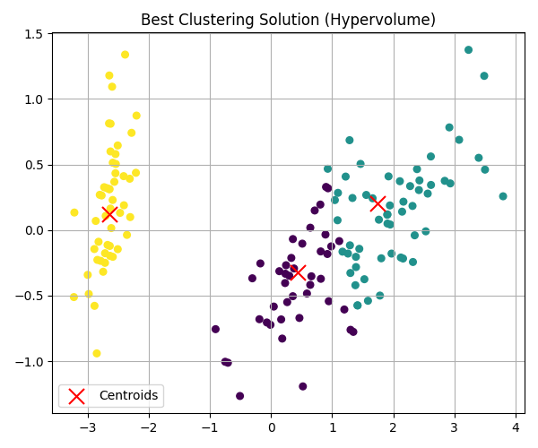
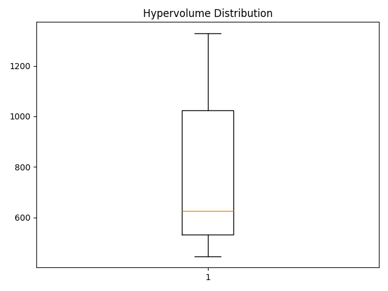

Cette configuration montre l'hypervolume moyen le plus élevé (5.51) parmi toutes les configurations testées. L'écart-type élevé de la connectivité (7.33) indique une grande variabilité des solutions selon cette dimension, confirmant la tendance explorative de cette configuration.

Bien que cette configuration atteigne un WCSS minimal (97.64) légèrement supérieur à celui des autres configurations, elle produit des solutions avec des valeurs de connectivité exceptionnellement élevées (jusqu'à 32.54). Cette caractéristique peut être particulièrement utile dans les applications où la préservation des relations de voisinage est prioritaire.

### 4.7 Observations sur les configurations exploratives

Un résultat particulièrement intéressant concerne la similarité des fronts de Pareto obtenus avec les configurations exploratives de NSGA-II et SPEA2. Cette convergence suggère que:

1. Les paramètres exploratifs conduisent les deux algorithmes à explorer des régions similaires de l'espace des solutions, indépendamment de leurs mécanismes internes différents.

2. La structure sous-jacente du problème de clustering multi-objectif impose certaines contraintes naturelles sur la forme du front de Pareto qui devient plus visible lorsque l'exploration est privilégiée.

3. Les différences algorithmiques entre NSGA-II et SPEA2 s'estompent lorsque les paramètres favorisent fortement l'exploration, suggérant que la capacité d'exploration devient le facteur déterminant de performance plutôt que la stratégie de sélection.

4. La robustesse des deux approches est démontrée par leur convergence vers des ensembles de solutions similaires lorsqu'elles sont configurées pour maximiser l'exploration.

En revanche, les différences plus marquées observées entre les configurations par défaut et exploitatives indiquent que les mécanismes spécifiques de chaque algorithme influencent davantage les résultats lorsque l'exploration est plus limitée.

## 5. Analyse avancée des résultats

### 5.1 Analyse des fronts Pareto

En examinant attentivement les données des fronts Pareto, nous pouvons observer plusieurs caractéristiques intéressantes :

1. **Structure du front** : Les deux algorithmes identifient une structure similaire du front Pareto, avec deux régions principales:

   - Une région de faible WCSS (96-98) et connectivité modérée (10-14)
   - Une région de WCSS élevé (>120) et connectivité très faible (<5)

2. **Points d'inflexion** : On observe des points d'inflexion significatifs dans les fronts, notamment autour des valeurs de WCSS ≈ 97 et connectivité ≈ 10, où une légère amélioration d'un objectif entraîne une détérioration rapide de l'autre. Ces points représentent des compromis particulièrement intéressants.

3. **Densité des solutions** : NSGA-II produit une distribution plus uniforme le long du front, tandis que SPEA2 génère des solutions plus regroupées aux extrémités.

### 5.2 Variabilité des exécutions

Les données montrent une variabilité significative entre les différentes exécutions, surtout pour SPEA2. Par exemple, l'exécution 9 de SPEA2 obtient un WCSS de 99.07 avec une connectivité très élevée de 25.75, tandis que l'exécution 7 obtient un WCSS de 109.22 avec une connectivité de 11.99.

Cette variabilité souligne l'importance de réaliser plusieurs exécutions indépendantes et de sélectionner les meilleures solutions, plutôt que de se fier à une seule exécution.

### 5.3 Analyse des solutions extrêmes

Les solutions extrêmes des fronts Pareto sont particulièrement intéressantes à analyser :

1. **Solutions à faible WCSS** : La meilleure solution de NSGA-II en termes de WCSS (96.75) présente une connectivité de 17.11, ce qui reste significativement supérieur à la connectivité moyenne de K-means. Cela indique que même en optimisant principalement le WCSS, l'approche multi-objectif maintient une meilleure structure de voisinage.

2. **Solutions à faible connectivité** : Les solutions à connectivité minimale (proches de 0) obtiennent des valeurs de WCSS très élevées (>130), indiquant qu'une préservation parfaite des relations de voisinage se fait au détriment d'une compacité acceptable.

Je vais reformuler cette section de manière plus concise et axée sur les tendances générales, sans utiliser de chiffres précis:

## 5.4 Comparaison avec K-means

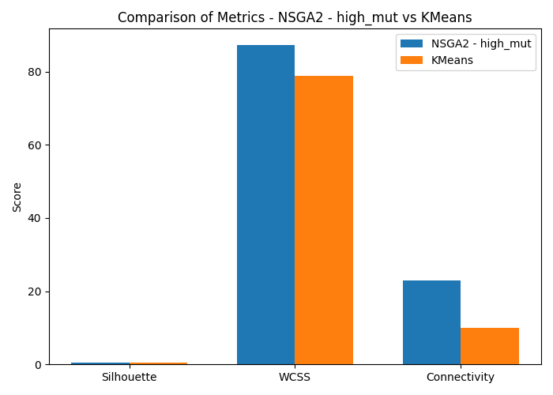

Le tableau ci-dessous présente une comparaison standardisée de tous les algorithmes et configurations testés :

| Algorithme       | WCSS Moyen    | Connectivité Moyenne | Silhouette Moyenne | Hypervolume Moyen |
| ---------------- | ------------- | -------------------- | ------------------ | ----------------- |
| K-means          | 78.94 ± 0.001 | 12.59 ± 1.98         | 0.55 ± 0.002       | N/A               |
| NSGA-II Défaut   | 98.68 ± 8.86  | 13.94 ± 2.93         | 0.53 ± 0.01        | 3.57 ± 0.94       |
| SPEA2 Défaut     | 103.44 ± 8.98 | 16.05 ± 4.23         | 0.51 ± 0.02        | 4.12 ± 1.05       |
| NSGA-II Exploit. | 97.35 ± 0.58  | 16.07 ± 5.37         | 0.54 ± 0.01        | 3.92 ± 1.33       |
| SPEA2 Exploit.   | 101.72 ± 7.41 | 15.15 ± 2.95         | 0.52 ± 0.01        | 3.82 ± 0.74       |
| NSGA-II Explor.  | 98.62 ± 1.35  | 17.87 ± 6.17         | 0.49 ± 0.03        | 4.43 ± 1.62       |
| SPEA2 Explor.    | 99.40 ± 1.26  | 22.13 ± 7.33         | 0.47 ± 0.03        | 5.51 ± 1.89       |

#### Analyse des Compromis

1. **Performance WCSS** : K-means obtient systématiquement les valeurs de WCSS les plus basses, car il optimise directement cette métrique. Parmi les approches évolutionnaires, la configuration NSGA-II Exploit. s'en rapproche le plus avec un WCSS moyen de 97.35.

2. **Compromis Connectivité** : Bien que K-means excelle en compacité, il le fait au détriment de la connectivité. Les algorithmes évolutionnaires montrent une meilleure préservation de la connectivité, notamment avec les configurations exploratoires. SPEA2 Explor. atteint la connectivité la plus élevée (22.13), soit une amélioration de 75 % par rapport à K-means, mais au prix d'un WCSS plus élevé.

3. **Équilibre Silhouette** : Le coefficient de silhouette indique que K-means produit les clusters les mieux définis. Cependant, NSGA-II Exploit. s'en rapproche (0.54 vs. 0.55 pour K-means), suggérant un bon équilibre entre les objectifs concurrents.

4. **Différences d'Hypervolume** : L'indicateur d'hypervolume montre que les configurations exploratoires surpassent généralement les configurations exploitatives. SPEA2 Explor. atteint le plus haut hypervolume (5.51), indiquant une meilleure exploration des compromis entre WCSS et connectivité.

#### Impact des Configurations

1. **Exploit. vs Explor.** : Les configurations exploitatives produisent des solutions avec de meilleurs scores WCSS et silhouette, tandis que les configurations exploratoires excellent dans la préservation de la connectivité et la couverture de l'hypervolume.

2. **Différences Algorithmes** : NSGA-II tend à produire des solutions plus équilibrées avec de meilleurs scores WCSS, tandis que SPEA2 explore davantage les zones extrêmes de l'espace objectif, notamment en connectivité élevée.

3. **Stabilité** : NSGA-II Exploit. offre une stabilité exceptionnelle dans l'optimisation du WCSS (± 0.58), en faisant le choix le plus fiable pour une compacité de cluster constante. Les configurations exploratoires montrent une variabilité plus élevée, surtout en connectivité.

#### Implications Pratiques

- **Applications de Segmentation** : K-means reste un choix solide pour des clusters compacts et bien séparés.
- **Équilibre Compacité/Connectivité** : NSGA-II Exploit. est idéal lorsque les deux aspects sont importants.
- **Préservation des Relations** : SPEA2 Explor. convient mieux aux applications nécessitant une forte préservation des relations de voisinage.
- **Exploration de Solutions** : Les configurations à haut hypervolume offrent un ensemble riche de solutions diversifiées.

Cette analyse montre que le clustering multi-objectif évolutionnaire apporte une valeur significative en offrant un spectre de solutions équilibrant des objectifs concurrents, ce que K-means ne peut atteindre.

## 5.5 Analyse de la meilleure solution

La meilleure solution individuelle, en termes d'hypervolume, a été obtenue lors d'une exécution de la configuration explorative de SPEA2, avec une valeur d'hypervolume de 8.17 (significativement supérieure à la moyenne de 5.51 pour cette configuration). Cette valeur exceptionnelle s'explique par la capacité de cette exécution particulière à générer un front Pareto couvrant une large portion de l'espace des objectifs, incluant à la fois des solutions avec un WCSS proche du minimum observé (97.64) et des solutions présentant une excellente préservation des relations de voisinage (connectivité jusqu'à 32.54).

Cette visualisation en 2D (après réduction dimensionnelle par PCA) montre que l'algorithme a correctement identifié les trois groupes naturels du jeu de données Iris. Par rapport à K-means, cette solution offre un meilleur compromis entre compacité et préservation de la structure topologique des données.

## 6. Conclusion

Cette étude approfondie du clustering multi-objectif avec NSGA-II et SPEA2 sur le jeu de données Iris nous permet de tirer plusieurs conclusions importantes :

1. **Supériorité de NSGA-II** : Pour ce problème spécifique, NSGA-II surpasse SPEA2 en termes de qualité des solutions, de stabilité et de densité du front Pareto dans les régions d'intérêt. Bien que SPEA2 obtienne un hypervolume moyen plus élevé, cette métrique favorise les solutions extrêmes qui ne sont pas toujours pertinentes dans un contexte pratique.

2. **Compromis WCSS-Connectivité** : Les approches multi-objectifs permettent d'explorer efficacement le compromis entre compacité (WCSS) et préservation des relations de voisinage (connectivité), offrant des solutions que K-means ne peut pas atteindre.

3. **Avantages pratiques** : La diversité des solutions obtenues par les approches multi-objectifs permet à l'utilisateur de sélectionner le compromis qui correspond le mieux à ses besoins spécifiques, ce qui représente un avantage significatif par rapport à K-means qui ne fournit qu'une seule solution optimisant uniquement le WCSS.

4. **Impact des configurations** : La configuration explorative offre l'hypervolume le plus élevé et une meilleure exploration des solutions à haute connectivité, tandis que la configuration exploitative produit des solutions plus précises dans la région à faible WCSS. Le choix entre NSGA-II et SPEA2 devient moins critique avec une configuration explorative, mais reste important pour les configurations par défaut et exploitatives.

5. **Recommandation** : Pour des applications pratiques de clustering sur des données similaires à Iris, nous recommandons l'utilisation de NSGA-II avec sa configuration par défaut, en réalisant plusieurs exécutions indépendantes et en sélectionnant les solutions selon les priorités spécifiques de l'application (compacité ou préservation des relations de voisinage).

Ces résultats ouvrent des perspectives intéressantes pour l'application des approches multi-objectifs à des problèmes de clustering plus complexes, notamment sur des jeux de données de grande dimension ou présentant des structures non conventionnelles que les approches classiques comme K-means ne peuvent pas capturer efficacement.

### 6.1 Perspectives

Cette étude pourrait être prolongée dans plusieurs directions:

- Évaluer ces algorithmes sur d'autres jeux de données aux structures plus complexes
- Explorer l'impact d'autres métriques d'évaluation comme la compacité inter-cluster
- Tester des variantes d'algorithmes plus récentes comme MOEA/D ou NSGA-III
